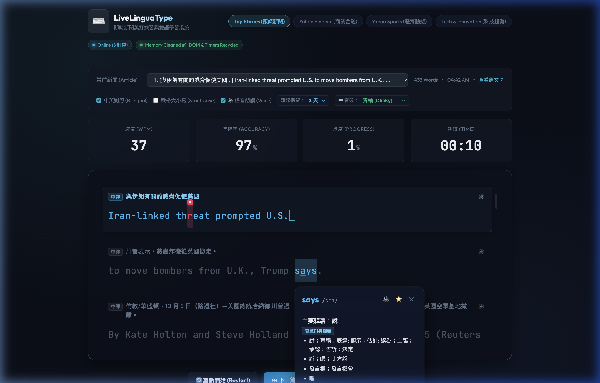

# ⌨️ LiveLinguaType

> **Practice English typing with real-time news feeds, mechanical keyboard sounds, and bilingual translation (EN/ZH).**  
> 結合即時新聞 RSS、繁體中文雙語句子對齊、機械鍵盤音效、真人語音伴讀與單字即時查詞的現代化英打學習系統。

[](http://35.208.129.210)
[](https://www.typescriptlang.org/)
[](https://vitejs.dev/)
[](https://expressjs.com/)
[](LICENSE)

---

## 📸 介面預覽 (Interface Preview)

### 🌟 即時新聞雙語英打介面 (Live Typing & Active Sentence View)
文章逐句顯示繁體中文翻譯，打字進度即時計算 WPM 與準確率；按錯鍵時於上方即時浮動標註錯誤按鍵，打字時當前句子自動平滑滾動置頂！



---

### 📖 點擊即查微型詞典與生字本 (Interactive Dictionary Popover & Wordbook)
練習過程中遇到生詞，直接滑鼠點擊任意英文單字即可彈出深色毛玻璃詞典，顯示繁體中文 Yahoo 奇摩字典釋義、音標、真人發音朗讀，並支援一鍵加入生字本 ⭐！


---

## ✨ 核心特色 (Core Features)

1. **📰 即時新聞內容 (Live RSS News Feeds):**
   - 與 Yahoo News 等主流新聞媒體同步，文章永遠保持最新，擺脫枯燥陳舊的固定題庫。
   - 支援頭條新聞 (Top Stories)、商業金融 (Finance)、體育動態 (Sports) 與科技趨勢 (Tech) 多分類一鍵切換。

2. **🌐 雙語對照學習與自動置頂 (Bilingual Sentence Alignment & Auto-Scroll):**
   - **逐句精準對照：** 在英文練習句上方即時呈現對應的繁體中文翻譯。
   - **平滑自動置頂 (Auto-scroll to Top)：** 當切換到新句子時，視窗平滑自動將當前句子捲動至打字區頂端，保持最佳視線水平。
   - **學習模式切換：** 支援一鍵在「雙語學習 (Bilingual)」與「純英打專注 (English Only)」模式間無縫切換。

3. **🎧 真人語音朗讀伴讀 (Web Speech API TTS):**
   - 原生支援 Web Speech 語音合成引擎，邊打字邊聆聽純正母語發音。
   - 支援自訂語速 (0.75x ~ 1.5x) 與美式/英式發音偏好切換。
   - 快捷鍵 `Ctrl + J`（Mac 支援 `Ctrl + J` 或 `Cmd + J`）即可隨時重播當前句朗讀。

4. **⌨️ 機械鍵盤擬真音效 (Mechanical Keyboard Sound FX):**
   - 內建高品質機械鍵盤音效（青軸 Clicky、茶軸 Tactile、紅軸 Linear）。
   - 具備多聲道音效池與自訂音量滑桿，帶來極致沉浸的敲擊打字手感。

5. **🎯 零誤差打字引擎 (Zero-Drift Typing Engine):**
   - 即時計算 WPM (Words Per Minute)、準確率 (Accuracy) 與文章完成進度。
   - **打錯字即時懸浮標籤 (Typed Char Above Badge)：** 按錯鍵時直接在英文字上方浮現按下的按鍵（例如誤按的字母或空白鍵），精準修正肌肉記憶。
   - 中文輸入法 (IME) 與 CapsLock 誤觸即時預警提示。

6. **⚡ 輕量高效後端架構 (Zero-Config Backend):**
   - 內建高效率 Google GTX 翻譯代理與 RSS 摘要擷取服務，完全免 API Key 開箱即用。
   - 具備伺服器記憶體快取 (In-Memory Cache) 與快取清理 (Purge Cache) 機制。

---

## ⌨️ 常用快捷鍵 (Keyboard Shortcuts)

| 快捷鍵 (Shortcut) | 動作功能 (Action) |
| :--- | :--- |
| `Ctrl + J` / `Cmd + J` | 重複朗讀當前正在練習的句子 (TTS Replay Active Sentence) |
| `Esc` | 關閉微型查詞視窗或返回打字輸入 (Close Dictionary Popover) |
| `滑鼠點擊單字` | 查詢該單字之 Yahoo 奇摩繁體中文釋義、音標與加入生字本 |

---

## 🚀 快速開始 (Quick Start)

### 1. 安裝依賴 (Install Dependencies)
```bash
npm install
```

### 2. 本地啟動開發環境 (Run Locally)
前後端將同時啟動（前端 Vite: `http://localhost:5173`，後端 Express: `http://localhost:3001`）：
```bash
npm run dev
```

### 3. 建置生產環境版本 (Production Build)
```bash
npm run build
```

---

## ☁️ 雲端部署 (Deployment)

已建置完成的本系統可直接部署於各大雲端平台或 VPS (如 Google Cloud Platform Compute Engine)：

```bash
# 1. 在雲端伺服器複製專案
git clone https://github.com/alntu2/LiveLinguaType.git
cd LiveLinguaType

# 2. 安裝依賴並建置前端靜態資源
npm install
npm run build

# 3. 使用 PM2 於背景守護執行 (支援 Port 80 直接訪問)
sudo npm install -g pm2
sudo PORT=80 pm2 start "npx tsx server/index.ts" --name livelinguatype
sudo pm2 save
```

---

## 🛠 技術棧 (Tech Stack)

* **前端 (Frontend):** TypeScript, Vite, Vanilla CSS (Modern Dark Mode & Glassmorphism Aesthetics)
* **後端 (Backend):** Node.js, Express, `rss-parser`, `tsx`
* **語音與音訊 (Audio):** Web Speech API, Web Audio API Sound FX
* **翻譯引擎 (Translator):** Single-Pass Multi-Sentence Google GTX Proxy
* **字型 (Typography):** JetBrains Mono, Outfit, Noto Sans TC

---

## 📄 開源協議 (License)

MIT License © 2026 LiveLinguaType
